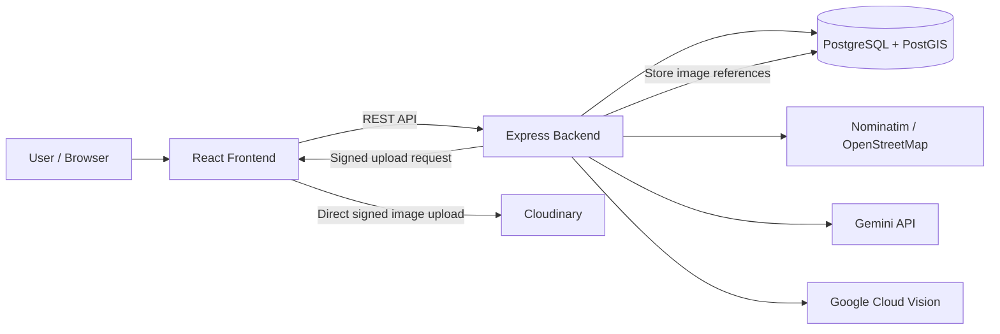

# AI-Enhanced Geospatial Travel Journal

A full-stack web application for documenting travel experiences through geospatial data, images, automated analysis, and AI-assisted validation.

The project combines a React frontend, an Express backend, PostgreSQL/PostGIS, external AI services, and explicit validation logic for ambiguous or unreliable automated results.

## Why this project

Travel memories are usually split across photos, maps, notes, and different applications. This project brings those elements together around a geospatial travel post: text, images, coordinates, location metadata, visibility, sentiment, place category, and optional photo-location verification.

The technical focus is not only on storing travel posts, but on **data quality, geospatial consistency, external-service orchestration, and controlled decision logic**.

## Core Technical Highlights

- Full-stack architecture with **React**, **Express**, and **PostgreSQL/PostGIS**
- REST API separating the client, backend logic, persistence, and external services
- Geospatial storage using `geography(Point, 4326)` with spatial indexing
- **Gemini API** integration for location-aware contextual information
- **Google Cloud Vision** landmark detection for photo-location verification
- **Nominatim / OpenStreetMap** for forward and reverse geocoding
- **Cloudinary** for signed image uploads and external media storage
- Automatic **photo-location** and **text-location** consistency checks
- Deterministic sentiment analysis with explicit lexical rules
- Automatic place classification into eight application-level categories
- JWT-based authentication, defensive validation, rate limiting, caching, retry logic, and controlled error handling

## Architecture



The backend is the main control point for authentication, validation, data access, geocoding, AI requests, caching, rate limiting, and error handling. Image files are uploaded directly from the browser to Cloudinary using a backend-generated signed payload, while only secure image references are persisted in the database.

## Photo-Location Validation

The photo-location verification flow is intentionally **not binary**. Automated visual recognition can be uncertain, so the application distinguishes between reliable matches, clear mismatches, and inconclusive results.

Google Cloud Vision performs `LANDMARK_DETECTION` on visually eligible locations. When a detected landmark contains valid coordinates, the application compares it with the user-selected location using the Haversine distance.

### Decision policy

| Condition | Result |
|---|---|
| Location is not visually eligible | `skipped` |
| No reliable landmark / score / coordinates | `uncertain` |
| Distance <= 2.5 km | `match` |
| Distance >= 5 km and confidence >= 0.75 | `mismatch` |
| Any other case | `uncertain` |

The 2.5-5 km interval is treated as a gray zone. A `mismatch` requires both a sufficiently large distance and a sufficiently strong confidence score, reducing false rejections when landmarks are visually ambiguous or geographically close.

For clear mismatches, the application can block the save/update operation. Ambiguous cases remain `uncertain` instead of being incorrectly rejected.

## Text-Location Consistency

The application also performs an auxiliary text-location check:

1. Gemini extracts the main location referenced in the post title and content.
2. Nominatim geocodes the extracted location.
3. The result is compared with the selected post location using Haversine distance.
4. The application distinguishes between a confirmed inconsistency and cases where the external analysis is too uncertain to justify blocking the user.

This provides a second validation signal without treating AI output as automatically authoritative.

## Automated Content Processing

### Sentiment analysis

Sentiment is calculated automatically from the post title and content.

The implementation is **lexical, deterministic, and explainable**, rather than a trained neural model. It:

- supports Romanian and English lexical signals
- handles multi-word expressions
- accounts for negations
- applies intensifiers and diminishers
- limits repeated identical signals
- gives the title and content separate weights
- produces a score from `0` to `10`
- maps the final score to `negative`, `neutral`, or `positive`

The deliberately broad neutral interval helps avoid overconfident classification of mixed travel experiences.

### Place classification

Nominatim / OpenStreetMap metadata is normalized into eight application-level categories:

- `historical`
- `religious`
- `nature`
- `entertainment`
- `food_drink`
- `shopping`
- `urban_landmark`
- `other`

The classification combines OSM class/subtype metadata with controlled lexical fallbacks. Generic results such as cities, countries, roads, or neighborhoods are handled conservatively rather than force-classified.

## Geospatial Data Design

Post locations are stored in PostgreSQL/PostGIS using:

```text
geography(Point, 4326)
```

The geographic point is generated from longitude and latitude and supported by a **GiST spatial index** for efficient spatial queries.

The persistent model separates:

- users
- posts
- post images
- geocoding cache
- AI content cache

Selected denormalized fields such as city, country, sentiment, and place category are stored to support efficient filtering, display, and dashboard aggregation.

## External-Service Reliability

The application does not treat external APIs as guaranteed or instantaneous dependencies.

### Nominatim

- forward and reverse geocoding
- persistent geocoding cache
- normalized cache keys
- queued requests
- timeout and controlled retry behavior
- explicit request-rate control

### Gemini

- controlled backend prompts
- timeout and retry handling
- persistent response caching
- duplicate concurrent generation prevention
- controlled fallback/error responses

### Google Cloud Vision

- optimized Cloudinary image URLs before analysis
- landmark-result normalization
- candidate deduplication
- short-lived in-memory caching
- `match / uncertain / mismatch` interpretation instead of raw-provider output

## Security and Validation

The backend includes:

- JWT authentication using `HS256`
- 24-hour authentication tokens
- bcrypt password hashing
- protected routes
- login and registration rate limiting
- strict schema validation with Zod
- validation of required environment variables at startup
- defensive checks for configuration relationships and thresholds
- signed Cloudinary uploads
- media ownership and cleanup checks
- centralized controlled error handling

The project intentionally separates provider responses from application decisions: only the information required for display, audit, and validation is persisted instead of storing complete raw external responses.

## Main Application Areas

The application includes:

- Feed
- Interactive Map
- Dashboard
- User Profile
- Post Editor
- Post Detail
- Public / private post visibility
- Image management
- Geospatial search and location selection
- Sentiment and category-based aggregation

## Tech Stack

| Area | Technologies |
|---|---|
| Frontend | React, Vite, Leaflet |
| Backend | Node.js, Express, REST API |
| Database | PostgreSQL, PostGIS |
| Data access | Prisma ORM + explicit SQL where required for geospatial operations |
| AI / Vision | Gemini API, Google Cloud Vision |
| Geocoding / Maps | Nominatim, OpenStreetMap, Leaflet |
| Media | Cloudinary |
| Authentication / Validation | JWT, bcryptjs, Zod |
| Reliability | Caching, rate limiting, retry / timeout handling |

## Screenshots

<!-- Recommended: add 3-5 screenshots only.
Suggested order:
1. Post Editor with map/location selection
2. Interactive Map
3. Dashboard
4. Photo-location validation result
5. Feed / Post Detail
-->

## Engineering Decisions I Wanted to Explore

This project was built as a bachelor's thesis project and was used to explore several engineering questions:

- When should an automated decision be allowed to block user input?
- How should uncertainty from an external AI service be represented?
- Which geospatial operations belong in the ORM and which are better expressed in SQL?
- How can repeated external requests be reduced without hiding stale or inconsistent behavior?
- How can AI output be used as an application signal without treating it as ground truth?
- How should validation, caching, security, and external-service failures interact in one workflow?

The main design principle was to prefer **explicit, inspectable decision logic** over opaque automation.

## Academic Context

Developed as a bachelor's thesis project in Economic Informatics.

The project focuses on the intersection of:

- full-stack application development
- geospatial data engineering
- data validation and quality
- applied AI integration
- functional decision logic
- software reliability and security

---

**Author:** Ana-Maria-Antonia Mitu
