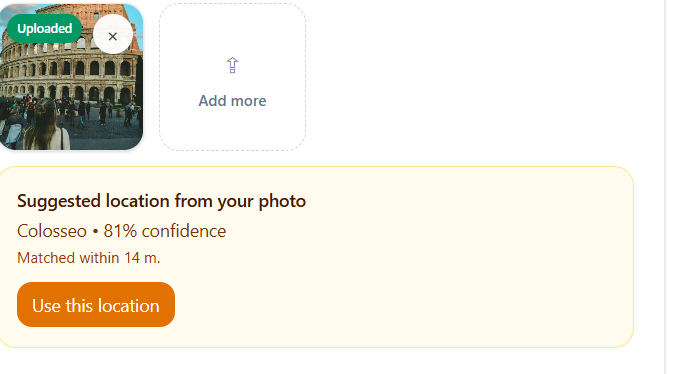
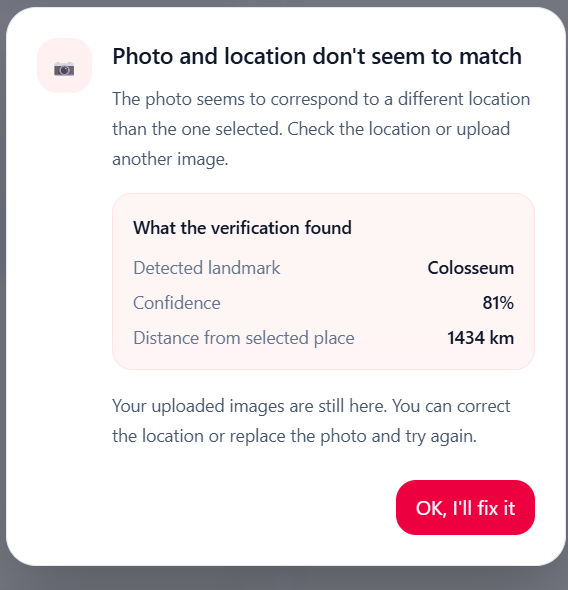
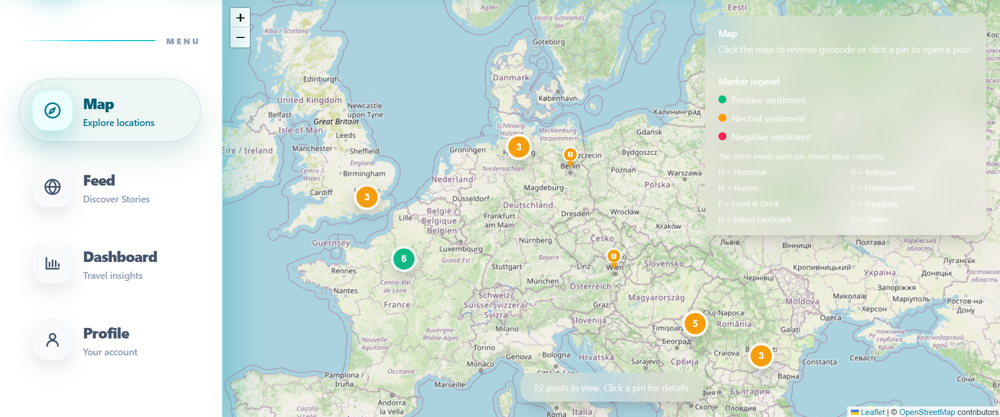
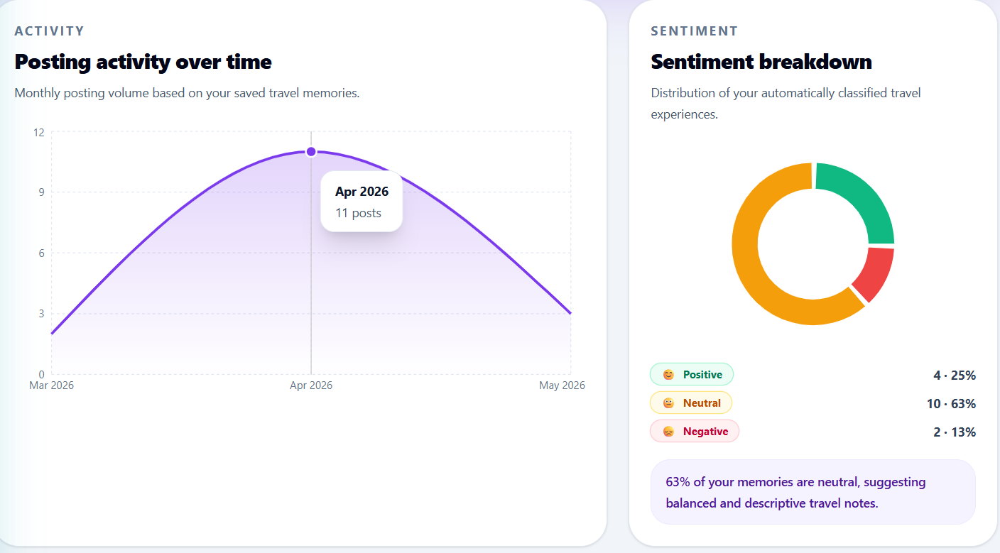
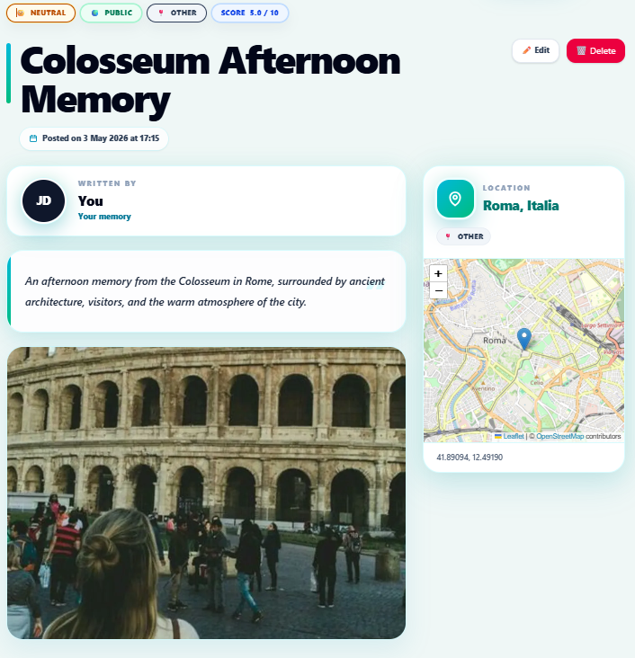
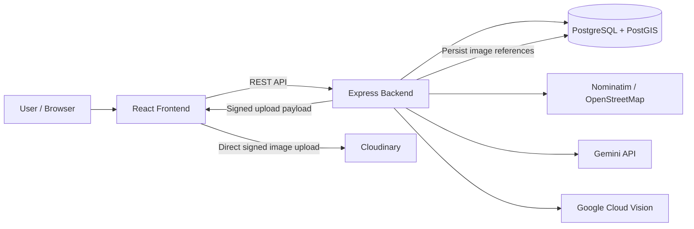

# AI-Enhanced Geospatial Travel Journal

A full-stack web application for documenting travel experiences through geospatial data, images, automated analysis, and AI-assisted validation.

The project combines a React frontend, an Express backend, PostgreSQL/PostGIS, external AI services, and explicit validation logic for ambiguous or unreliable automated results.

## Overview

Users can create travel posts linked to real geographic locations, attach images, explore posts on an interactive map, and review aggregated travel insights. The backend enriches each post with structured signals such as sentiment, place category, and location-consistency checks.

The main technical focus is not simply CRUD functionality, but **geospatial data quality, external-service orchestration, explainable validation logic, and controlled handling of uncertain AI results**.

## Screenshots

### Photo-location verification - matched result

Google Cloud Vision detects a landmark candidate, while the application evaluates confidence and geographic distance before suggesting it to the user.

<p align="center">
  
</p>

### Photo-location verification - mismatch handling

A high-confidence landmark that is far from the selected location is treated as a mismatch. The application explains the result and asks the user to correct the location or replace the image instead of silently accepting inconsistent data.

<p align="center">
  
</p>

### Interactive geospatial map

Posts are visualized with Leaflet and OpenStreetMap. Marker color represents sentiment, while marker labels encode the automatically assigned place category.



### Analytics dashboard

The dashboard aggregates posting activity and automatically derived sentiment information across the user's travel history.



### Post detail view

A travel post combines textual content, images, visibility, sentiment, classification, location metadata, and an embedded map in a single geospatial record.

<p align="center">
  
</p>

## Technical Highlights

- Full-stack architecture with **React**, **Express**, and **PostgreSQL/PostGIS**
- REST API separating client logic, backend validation, persistence, and external services
- Geospatial storage using `geography(Point, 4326)` with spatial indexing
- **Gemini API** integration for location-aware contextual information and text-location analysis
- **Google Cloud Vision** landmark detection for photo-location verification
- **Nominatim / OpenStreetMap** for forward and reverse geocoding
- **Cloudinary** for signed image uploads and external media storage
- Automatic photo-location and text-location consistency checks
- Deterministic sentiment analysis with explicit lexical rules
- Automatic place classification into eight application-level categories
- JWT authentication, defensive validation, rate limiting, caching, retries, and controlled error handling

## Architecture



The backend is the control point for authentication, validation, data access, geocoding, AI requests, caching, rate limiting, and error handling. Images are uploaded directly from the browser to Cloudinary through a backend-signed upload flow, while secure image references are persisted in the database.

## Photo-Location Validation

Photo-location verification is intentionally **not binary**. Automated landmark recognition can be uncertain, so the application distinguishes reliable matches, clear mismatches, and inconclusive results.

Google Cloud Vision performs `LANDMARK_DETECTION` for visually eligible locations. When a detected landmark contains valid coordinates, the application compares it with the selected location using Haversine distance.

| Condition | Result |
|---|---|
| Location is not visually eligible | `skipped` |
| No reliable landmark / score / coordinates | `uncertain` |
| Distance <= 2.5 km | `match` |
| Distance >= 5 km and confidence >= 0.75 | `mismatch` |
| Any other case | `uncertain` |

The 2.5–5 km interval is deliberately treated as a gray zone. A `mismatch` requires both a sufficiently large distance and sufficient confidence, reducing false rejections when landmarks are visually ambiguous or geographically close.

This design treats external AI output as a **signal**, not as ground truth.

## Text-Location Consistency

The application also performs an auxiliary text-location check:

1. Gemini extracts the main location referenced in the post title and content.
2. Nominatim geocodes the extracted location.
3. The resulting coordinates are compared with the selected post location using Haversine distance.
4. The application distinguishes confirmed inconsistency from cases where the external analysis is too uncertain to justify blocking the user.

## Automated Content Processing

### Sentiment analysis

Sentiment is calculated automatically from the post title and content using a **lexical, deterministic, and explainable** algorithm rather than a trained neural model.

The implementation:

- supports Romanian and English lexical signals
- handles multi-word expressions
- accounts for negations
- applies intensifiers and diminishers
- limits repeated identical signals
- weights title and content separately
- produces a score from `0` to `10`
- maps the score to `negative`, `neutral`, or `positive`

### Place classification

OpenStreetMap / Nominatim metadata is normalized into eight application-level categories:

- `historical`
- `religious`
- `nature`
- `entertainment`
- `food_drink`
- `shopping`
- `urban_landmark`
- `other`

The classification uses OSM class/subtype metadata together with controlled lexical fallbacks. Generic results such as cities, countries, roads, and neighborhoods are handled conservatively rather than force-classified.

## Geospatial Data Design

Post locations are stored in PostgreSQL/PostGIS as:

```text
geography(Point, 4326)
```

The geographic point is generated from longitude and latitude and supported by a **GiST spatial index** for efficient spatial queries.

The persistent model separates:

- users
- posts
- post images
- geocoding cache
- AI content cache

Selected denormalized fields such as city, country, sentiment, and place category support efficient filtering, rendering, and dashboard aggregation.

## External-Service Reliability

The application does not assume that external APIs are always available or reliable.

### Nominatim
- forward and reverse geocoding
- persistent geocoding cache
- normalized cache keys
- queued requests
- timeout and controlled retry behavior
- explicit request-rate control

### Gemini
- controlled backend prompts
- timeout and retry handling
- persistent response caching
- duplicate concurrent-generation prevention
- controlled fallback/error responses

### Google Cloud Vision
- optimized Cloudinary image URLs before analysis
- landmark-result normalization
- candidate deduplication
- short-lived in-memory caching
- application-level `match / uncertain / mismatch` interpretation

## Security and Validation

The backend includes:

- JWT authentication using `HS256`
- 24-hour authentication tokens
- bcrypt password hashing
- protected routes
- login and registration rate limiting
- strict schema validation with Zod
- startup validation for required environment variables
- defensive validation of configuration relationships and thresholds
- signed Cloudinary uploads
- media ownership and cleanup checks
- centralized controlled error handling

Only the interpreted information needed for display, audit, and validation is persisted from external vision results rather than storing complete raw provider responses.

## Tech Stack

| Area | Technologies |
|---|---|
| Frontend | React, Vite, Leaflet |
| Backend | Node.js, Express, REST API |
| Database | PostgreSQL, PostGIS |
| Data access | Prisma ORM + explicit SQL for geospatial operations where needed |
| AI / Vision | Gemini API, Google Cloud Vision |
| Geocoding / Maps | Nominatim, OpenStreetMap, Leaflet |
| Media | Cloudinary |
| Authentication / Validation | JWT, bcryptjs, Zod |
| Reliability | Caching, rate limiting, retry / timeout handling |

## Running Locally

### Prerequisites

- Node.js and npm
- PostgreSQL with the PostGIS extension enabled
- API credentials for Cloudinary and Gemini
- Google Cloud Vision credentials if photo-location verification is enabled
- A valid identifying `User-Agent` for Nominatim requests

### Environment

Create the backend environment configuration used by the project. At minimum, the application expects:

```text
DATABASE_URL=...
JWT_SECRET=...
NOMINATIM_USER_AGENT=...
```

You will also need to provide the Cloudinary, Gemini, and — when enabled — Google Cloud Vision credentials referenced by the backend configuration.

### Install and start

The project contains separate frontend and backend Node.js applications. Install dependencies in each application directory:

```bash
npm install
```

Apply the database setup/migrations included with the project, then start the backend and frontend using the development script defined in their respective `package.json` files:

```bash
npm run dev
```

> If your local `package.json` uses a different script name, use the script defined there. API credentials and secrets should remain in local environment files and must not be committed to Git.

## Engineering Decisions

The project was used to explore several engineering questions:

- When should an automated decision be allowed to block user input?
- How should uncertainty from an external AI service be represented?
- Which geospatial operations belong in the ORM and which are better expressed in SQL?
- How can repeated external requests be reduced without hiding failures?
- How can AI output be used as an application signal without treating it as ground truth?
- How should validation, caching, security, and external-service failures interact in one workflow?

The core design principle is to prefer **explicit, inspectable decision logic** over opaque automation.

## Academic Context

Developed as a bachelor's thesis project in Economic Informatics, with a focus on:

- full-stack application development
- geospatial data
- data validation and quality
- applied AI integration
- functional decision logic
- software reliability and security

---

**Author:** Ana-Maria-Antonia Mitu
